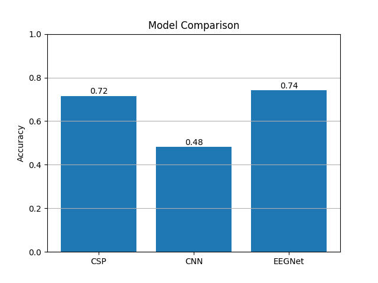
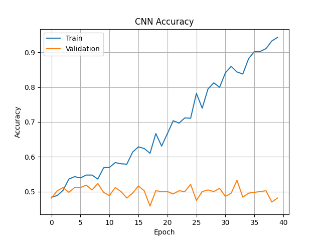
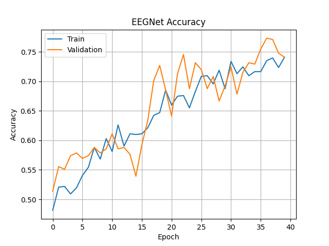

#  EEG Motor Imagery Classification: Cross-Subject Generalization Study

##  Overview

This project investigates **cross-subject generalization in EEG-based motor imagery classification**, a key challenge in Brain-Computer Interface (BCI) systems.

We conduct a **controlled experimental comparison** between:

* **CSP + SVM** (traditional method)
* **CNN** (generic deep learning)
* **EEGNet** (EEG-specific deep learning model)

>  **Objective:**
> To evaluate whether deep learning models can generalize across subjects and how architecture design impacts performance.

---

##  Dataset

* **Dataset:** BCI Competition IV 2a
* **Subjects:** 9
* **Task:** Motor imagery (Left vs Right hand)
* **Evaluation:** Cross-subject split

  * Train: Subjects 1–6
  * Test: Subjects 7–9

---

##  Pipeline

```
Raw EEG → Preprocessing → Model → Evaluation
```

### Preprocessing:

* Bandpass filtering: **8–30 Hz (Mu & Beta bands)**
* Normalization (training statistics)
* Data augmentation:

  * Gaussian noise
  * Time shifting
  * Amplitude scaling
* Time window cropping: **0.5–3.5 sec**

---

##  Models Compared

### 1. CSP + SVM

* Handcrafted spatial filtering
* Classical machine learning approach

---

### 2. CNN (Generic)

* Standard convolutional neural network
* Learns features automatically
* No EEG-specific inductive bias

---

### 3. EEGNet

* Lightweight CNN designed for EEG
* Learns temporal and spatial features

---

##  Results

###  Model Comparison



**Observation:**

* EEGNet achieves the highest performance (~0.74)
* CSP remains competitive (~0.71)
* CNN fails (~0.48), indicating poor generalization

---

###  CNN Behavior (Failure Case)



**Insight:**

* Training accuracy increases to ~95%
* Validation accuracy remains ~50%
* Indicates **severe overfitting**
* CNN learns subject-specific patterns instead of generalizable features

---

### ✅ EEGNet Behavior (Successful Model)



**Insight:**

* Training and validation curves are closely aligned
* Stable learning across epochs
* Demonstrates strong generalization across subjects

---

##  Key Findings

* CNN fails in cross-subject EEG classification due to overfitting
* EEGNet generalizes well due to domain-specific design
* CSP remains competitive with proper preprocessing
* Signal preprocessing significantly impacts performance

---

##  Core Insight

> Generic CNN models fail to generalize in cross-subject EEG classification, whereas EEGNet demonstrates robust performance due to its domain-specific architecture.

---

##  Project Structure

```
EEGNet-Project/
│
├── images/
│   ├── cnnaccuracy.png
│   ├── eegnetaccuracy.png
│   ├── modelcomparison.png
│
├── models/
├── data_loader.py
├── preprocess.py
├── train.py
├── evaluate.py
└── README.md
```

---

## ▶️ How to Run

```bash
python train.py
```

---

##  Future Work

* Evaluate on additional EEG datasets
* Improve CNN generalization
* Explore transformer-based models
* Study domain adaptation techniques

---

*This project focuses on understanding model behavior and generalization in EEG decoding.*
