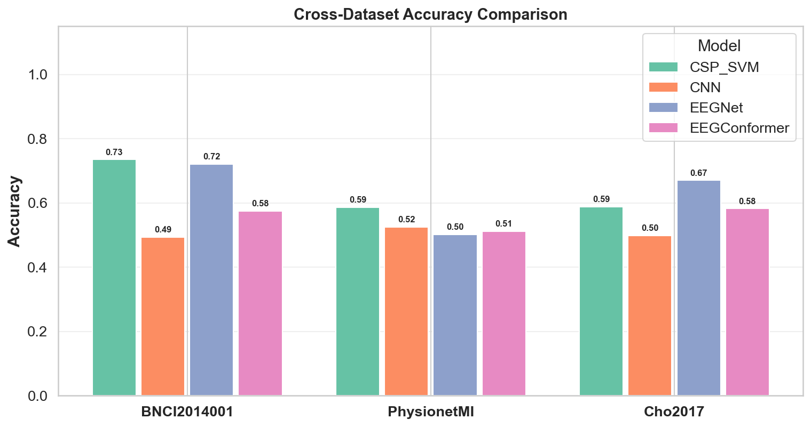
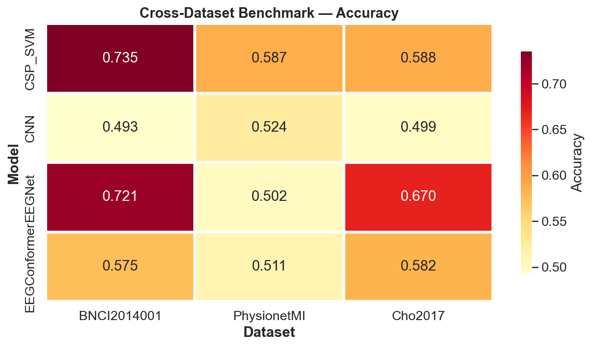
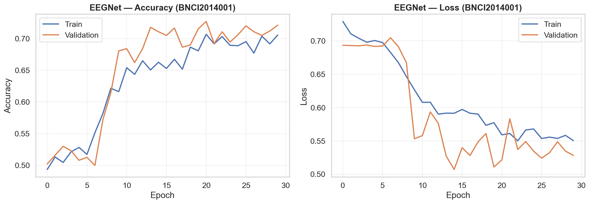

# Cross-Subject EEG Motor Imagery Benchmarking Framework for Multi-Dataset BCI Evaluation

Benchmarking CSP-SVM, CNN, EEGNet, and EEG Conformer models for cross-subject EEG motor imagery classification across multiple public BCI datasets.


## Highlights

- 3 public EEG motor imagery datasets
- 4 benchmark models (CSP-SVM, CNN, EEGNet, EEG Conformer)
- Cross-subject evaluation pipeline
- Automated benchmarking and visualization
- Publication-quality figures
- Modular and extensible architecture

---

## Overview

**Motor imagery (MI)** — the mental rehearsal of movement without physical execution — produces measurable changes in EEG signals over sensorimotor cortex. Decoding these patterns is central to non-invasive **Brain-Computer Interfaces (BCIs)**, enabling applications from assistive communication to neural rehabilitation.

A persistent challenge in MI-BCI research is **cross-subject generalization**: models trained on one group of subjects must decode neural patterns from entirely unseen individuals, despite substantial inter-subject variability in EEG morphology, electrode impedance, and cortical anatomy.

This framework provides a **standardized benchmarking environment** to systematically compare classification approaches under identical preprocessing, augmentation, and evaluation conditions — enabling fair, reproducible comparisons across datasets and model families.

<p align="center">
  
</p>

---

## Key Features

- **Multi-dataset benchmarking** — unified evaluation across 3 standard MI datasets (BNCI2014001, PhysioNet MI, Cho2017)
- **Modular architecture** — plug-in model, dataset, and preprocessing components via abstract base classes and registries
- **4 model families** — classical ML (CSP+SVM), generic deep learning (CNN), domain-specific deep learning (EEGNet), and transformer-based (EEG Conformer)
- **Cross-subject evaluation** — train/test splits across disjoint subject groups
- **Reproducible experiments** — dataclass-based configuration, fixed seeds, centralized logging
- **Automated visualization pipeline** — training curves, confusion matrices, per-dataset comparisons, cross-dataset heatmaps, and multi-metric charts
- **Comprehensive metrics logging** — accuracy, precision, recall, F1-score, confusion matrices, training/inference times saved as JSON and CSV

---

## Datasets

All datasets are loaded automatically via [MOABB](https://moabb.neurotechx.com/) (Mother of All BCI Benchmarks) with built-in downloading and caching.

| Dataset | Subjects | EEG Channels | Sample Rate | MI Task | Reference |
|---------|----------|--------------|-------------|---------|-----------|
| **BNCI2014001** | 9 | 22 | 250 Hz | Left / Right hand | BCI Competition IV 2a |
| **PhysioNet MI** | 109 | 64 | 160 Hz | Left / Right fist | Goldberger et al., 2000 |
| **Cho2017** | 52 | 64 | 512 Hz | Left / Right hand | Cho et al., 2017 |

All datasets are reduced to **binary classification** (left vs. right) for consistent benchmarking. Data is bandpass filtered to 8–30 Hz (mu + beta rhythms) and resampled to 128 Hz for cross-dataset consistency.

---

## Models Compared

### CSP + SVM (Classical ML)
**Common Spatial Patterns** learn spatial filters that maximize the variance ratio between two classes. Log-variance features are then classified by a linear **Support Vector Machine**. This remains a strong baseline in BCI competitions due to its principled use of spatial covariance structure.

### CNN (Generic Deep Learning)
A 3-block convolutional network (Conv2D → BatchNorm → ReLU → MaxPool) with a GlobalAveragePooling head. Serves as a generic deep learning baseline without EEG-specific inductive biases, to isolate the effect of domain knowledge in architecture design.

### EEGNet (Domain-Specific Deep Learning)
A compact CNN designed specifically for EEG decoding (Lawhern et al., 2018). Uses **temporal convolution → depthwise spatial convolution → separable convolution** to efficiently capture temporal and spatial EEG features with far fewer parameters than generic CNNs.

### EEG Conformer (Transformer-Based)
A lightweight convolutional-transformer hybrid (Song et al., 2023). Combines a **temporal convolution frontend** with **multi-head self-attention** transformer encoder blocks and sinusoidal positional encoding to capture both local and long-range temporal dependencies. Includes learning rate scheduling and early stopping for stable training on small EEG datasets.

---

## Experimental Pipeline

```
MOABB Dataset
    │
    ▼
Bandpass Filter (8–30 Hz, mu + beta rhythms)
    │
    ▼
Resampling (128 Hz, cross-dataset consistency)
    │
    ▼
Cross-Subject Train/Test Split
    │
    ▼
Channel-wise Normalization (training statistics)
    │
    ▼
Data Augmentation (training only)
  ├── Gaussian noise injection
  ├── Random time shifting
  └── Amplitude scaling
    │
    ▼
Model Training & Evaluation
    │
    ▼
Metrics, Visualizations, Saved Models
```

### Preprocessing Details
- **Bandpass filtering**: 8–30 Hz (FIR) targeting mu and beta rhythms
- **Resampling**: 128 Hz for uniform temporal resolution across datasets
- **Normalization**: channel-wise zero-mean, unit-variance using training set statistics
- **Augmentation** (training only): Gaussian noise (σ=0.01), circular time shift (±50 samples), amplitude scaling (0.9–1.1×)
- **Epoching**: 0.5–3.5s post-cue motor imagery window

---

## Results Summary

Benchmark results from cross-subject evaluation (disjoint train/test subject groups):

### Accuracy (%)

| Model | BNCI2014001 | PhysioNet MI | Cho2017 |
|-------|:-----------:|:------------:|:-------:|
| **CSP + SVM** | **73.50** | **58.67** | 58.80 |
| **CNN** | 49.31 | 52.44 | 49.90 |
| **EEGNet** | 72.11 | 50.22 | **67.00** |
| **EEG Conformer** | 57.52 | 51.11 | 58.20 |

### F1-Score (Macro)

| Model | BNCI2014001 | PhysioNet MI | Cho2017 |
|-------|:-----------:|:------------:|:-------:|
| **CSP + SVM** | **73.36** | **57.79** | 57.54 |
| **CNN** | 40.65 | 51.78 | 49.25 |
| **EEGNet** | 72.08 | 46.75 | **66.81** |
| **EEG Conformer** | 56.62 | 46.89 | 55.32 |

> **Best per dataset** values are bolded. All metrics are from held-out test subjects not seen during training.

---

## Key Findings

1. **CNN suffers severe overfitting** — the generic CNN consistently performs at or below chance level (~50%) on all datasets, despite high training accuracy. Without EEG-specific inductive biases, it memorizes training subjects rather than learning generalizable features.

2. **EEGNet achieves the strongest generalization** — domain-specific architectural priors (temporal → spatial → separable convolutions) enable EEGNet to learn transferable representations. It achieves 72.11% on BNCI2014001 and the highest accuracy on Cho2017 (67.00%).

3. **CSP + SVM remains surprisingly competitive** — the classical pipeline achieves the best accuracy on BNCI2014001 (73.50%) and PhysioNet MI (58.67%), demonstrating that well-designed feature engineering can outperform deep learning on limited EEG data.

4. **EEG Conformer is stable but data-hungry** — the transformer-based model shows consistent performance across datasets (~57%) without the catastrophic failure of the generic CNN, but does not reach EEGNet or CSP+SVM performance levels. Self-attention mechanisms likely require larger datasets to realize their full potential.

5. **PhysioNet MI is the hardest dataset** — all models struggle on PhysioNet MI, with the best accuracy at 58.67%. The combination of 64 channels, lower sample rate (160 Hz), and high subject count (109) may introduce more cross-subject variability than the other datasets.

6. **Transformer limitations on small EEG datasets** — despite theoretical advantages in capturing long-range dependencies, transformer architectures do not outperform compact domain-specific CNNs on typical MI-BCI dataset sizes (hundreds to low thousands of trials).

---

## Benchmark Visualizations

### Cross-Subject Generalization Heatmap (Accuracy)
<p align="center">
  
</p>

### EEGNet Training Dynamics (BNCI2014001)
<p align="center">
  
</p>

---

## Project Structure

```
EEGNet-Project/
│
├── configs/
│   └── experiment_config.py        # Dataclass-based experiment settings
│
├── datasets/
│   ├── base_dataset.py             # Abstract base class + EEGDataBundle
│   ├── bnci2014001.py              # BCI Competition IV 2a loader
│   ├── physionet_mi.py             # PhysioNet Motor Imagery loader
│   ├── cho2017.py                  # Cho2017 loader
│   └── registry.py                 # Dataset name → class mapping
│
├── models/
│   ├── base_model.py               # Abstract base class for all models
│   ├── csp_svm.py                  # CSP + SVM (classical ML)
│   ├── cnn.py                      # Generic 3-block CNN
│   ├── eegnet.py                   # EEGNet (Lawhern et al., 2018)
│   └── eeg_conformer.py            # EEG Conformer (Song et al., 2023)
│
├── preprocessing/
│   └── pipeline.py                 # Normalization + augmentation pipeline
│
├── experiments/
│   └── runner.py                   # Multi-dataset benchmark orchestrator
│
├── evaluation/
│   ├── metrics.py                  # Accuracy, Precision, Recall, F1
│   └── visualization.py            # Publication-quality plot generation
│
├── utils/
│   ├── io_utils.py                 # File I/O, model serialization
│   └── logging_config.py           # Centralized logging setup
│
├── scripts/
│   ├── regenerate_plots.py        # Re-generate figures from saved metrics
│   └── verify_conformer.py        # EEG Conformer validation script
│
├── results/                        # Auto-generated outputs
│   ├── eeg_benchmark/             # Raw experiment outputs
│   │   ├── all_results.json       # Complete metrics for all runs
│   │   ├── models/                # Saved model weights
│   │   ├── metrics/               # Per-model JSON metric files
│   │   ├── plots/                 # Raw visualization outputs
│   │   └── tables/                # CSV & LaTeX summary tables
│   └── final_results/             # Consolidated results
│       ├── figures/               # Publication-quality figures
│       ├── metrics/               # Aggregated metric files
│       ├── summaries/             # Experiment summaries
│       └── tables/                # benchmark_results.csv & .tex
│
├── run_benchmark.py               # Main entry point (CLI)
├── requirements.txt               # Python dependencies
└── README.md
```

---

## Installation

### Prerequisites
- Python 3.8+
- pip

### Setup

```bash
# Clone the repository
git clone https://github.com/aakif6542/EEG-motor-imagery.git
cd EEG-motor-imagery

# Install dependencies
pip install -r requirements.txt
```

### Dependencies
```
tensorflow>=2.10
numpy
scipy
scikit-learn
mne
moabb
matplotlib
seaborn
pandas
```

> **Note:** Datasets are downloaded automatically via MOABB on first run and cached locally in `datasets_cache/`.

---

## Usage

### Run Full Benchmark

```bash
python run_benchmark.py
```

This runs all 4 models across all 3 datasets with default settings (40 epochs, batch size 32, lr 0.001).

### Run Specific Datasets or Models

```bash
# Single dataset
python run_benchmark.py --datasets BNCI2014001

# Specific models only
python run_benchmark.py --models CSP_SVM EEGNet

# Combine selections
python run_benchmark.py --datasets BNCI2014001 Cho2017 --models EEGNet EEGConformer
```

### Custom Training Parameters

```bash
# Adjust training hyperparameters
python run_benchmark.py --epochs 50 --batch-size 64 --lr 0.0005

# Disable data augmentation
python run_benchmark.py --no-augment

# Set random seed for reproducibility
python run_benchmark.py --seed 123

# Name your experiment run
python run_benchmark.py --experiment-name my_experiment
```

### Regenerate Plots from Saved Metrics

```bash
python scripts/regenerate_plots.py
```

---

## Adding New Models

The framework is designed for easy extension via the `BaseModel` abstract class:

```python
# models/my_model.py
from models.base_model import BaseModel

class MyModel(BaseModel):
    @property
    def model_name(self):
        return "MyModel"

    def fit(self, X_train, y_train, X_val=None, y_val=None, **kwargs):
        # Training logic
        ...

    def predict(self, X):
        # Return predicted labels
        ...

    def evaluate(self, X_test, y_test):
        # Return accuracy
        ...

    def save(self, dirpath):
        ...

    def load(self, dirpath):
        ...

    def needs_channel_dim(self):
        # True if model expects (N, C, T, 1), False for (N, C, T)
        return True
```

Register in `models/__init__.py`:
```python
MODEL_REGISTRY["MyModel"] = MyModel
```

---

## Future Work

- **Self-supervised EEG pre-training** — contrastive or masked autoencoder pre-training on unlabeled EEG data to improve cross-subject transfer
- **Foundation models for EEG** — scaling transformer architectures with large-scale multi-dataset pre-training
- **Domain adaptation** — adversarial or distribution-alignment techniques to reduce cross-subject domain shift
- **Larger transformer architectures** — exploring Vision Transformer (ViT) and larger Conformer variants with sufficient pre-training data
- **Multimodal NeuroAI** — integrating EEG with fNIRS, EMG, or eye-tracking for richer neural decoding
- **Per-subject fine-tuning** — few-shot adaptation strategies for personalizing pre-trained models

---

## License

This project is released for academic and research purposes. Please cite the relevant dataset and model papers if you use this framework in your work.

---

## Acknowledgements

- **[MOABB](https://moabb.neurotechx.com/)** — Mother of All BCI Benchmarks, for standardized dataset access
- **[MNE-Python](https://mne.tools/)** — open-source EEG/MEG analysis toolkit
- **[BCI Competition IV](https://www.bbci.de/competition/iv/)** — BNCI2014001 dataset (Tangermann et al., 2012)
- **[PhysioNet](https://physionet.org/)** — EEG Motor Movement/Imagery Dataset (Goldberger et al., 2000)
- **[Cho et al., 2017](https://doi.org/10.1093/gigascience/gix034)** — Cho2017 dataset
- **EEGNet** — Lawhern et al., "EEGNet: A Compact Convolutional Neural Network for EEG-based Brain-Computer Interfaces", *Journal of Neural Engineering*, 2018
- **EEG Conformer** — Song et al., "EEG Conformer: Convolutional Transformer for EEG Decoding and Visualization", *IEEE Transactions on Neural Systems and Rehabilitation Engineering*, 2023

---

*Built for cross-subject and cross-dataset generalization research in EEG motor imagery decoding.*
